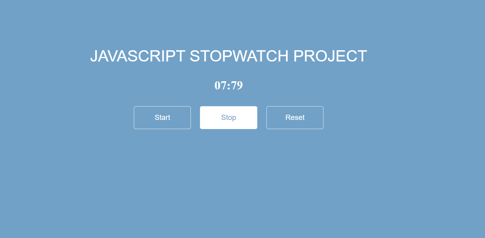

# ⏱️ Stopwatch App

Welcome to the **Stopwatch App**! 🚀 Whether you're timing your workouts, cooking, or just need to keep track of time, this app has got you covered!

## Features 🌟
- **Start, Stop, and Reset**: Easily control your timing with intuitive buttons.
- **Lap Functionality**: Keep track of multiple laps without breaking a sweat! 🏃‍♂️💨
- **User-Friendly Interface**: Clean and simple design for a seamless experience.
- **Responsive Design**: Works beautifully on both desktop and mobile devices! 📱💻

## How to Use 🛠️
1. **Start the Stopwatch**: Click the "Start" button to begin timing.
2. **Stop the Stopwatch**: Click "Stop" to pause your timing.
3. **Reset**: Click "Reset" to clear the time and start fresh.
4. **Laps**: Click "Lap" to record your lap times while the stopwatch is running.

## Screenshots 📸
Here’s a glimpse of what the app looks like:

*The main stopwatch interface ready for action!*
